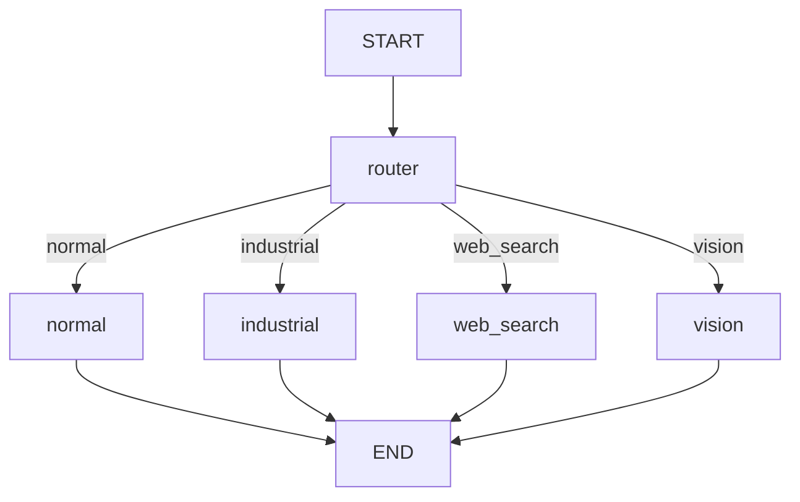

# Volt Agentic Industrial Assistant

Volt is a voice-friendly industrial assistant with a Next.js 3D avatar frontend and a Python/FastAPI backend. It uses LangGraph to route each request to the most appropriate capability: direct conversation, industrial knowledge retrieval, live web search, or camera-based object detection.

## Tech Stack

- **Frontend:** Next.js 16, React 19, TypeScript`
- **Backend:** Python, FastAPI, Uvicorn, Pydantic
- **Agent orchestration:** LangGraph `StateGraph`, conditional routing, typed state, message reducers
- **LLM:** Groq through LangChain (`openai/gpt-oss-120b`)
- **Industrial RAG:** Pinecone vector store, Hugging Face `all-MiniLM-L6-v2` embeddings
- **Web research:** DuckDuckGo via LangChain Community tools
- **Computer vision:** OpenCV webcam capture and Ultralytics YOLOv8
- **Model asset:** `yolov8n.pt`

## Project Layout

```text
.
├── backend.py          # FastAPI entry point and /chat adapter
├── agent_graph.py      # LangGraph state, nodes, tools, and compilation
├── requirements.txt    # Python dependencies
├── yolov8n.pt          # YOLOv8 detection weights
└── my-3d-avatar/       # Next.js frontend and 3D avatar UI
```

## How LangGraph Powers Volt

The agent is built as a small supervisor graph rather than one large prompt with every tool exposed at once. This keeps the behavior explicit and makes each capability independently understandable.



### 1. Shared state and message history

`AgentState` stores the conversation in a LangGraph-managed `messages` field and the router's selected destination. The `add_messages` reducer lets each node append its response while preserving the existing conversation history.

### 2. Structured routing

The `router` node sends the latest user message to a Groq model with a Pydantic `RouteDecision` schema. The model must return exactly one of `normal`, `industrial`, `web_search`, or `vision`. LangGraph's conditional edge reads `route_destination` and selects the corresponding node.

### 3. Capability nodes

- **`normal`:** answers conversational requests directly with the LLM.
- **`industrial`:** queries Pinecone for the two most relevant chunks, limits the context to 1,200 characters, and asks the LLM to summarize the grounded answer.
- **`web_search`:** runs DuckDuckGo search, truncates the result context, and asks the LLM to synthesize a current answer.
- **`vision`:** captures a frame from webcam index 0, runs YOLOv8, counts confident detections above 0.4, and gives the detected object list to the LLM.

Every capability node ends at `END`, so one request produces one final assistant response. The graph is compiled once when `agent_graph.py` is imported and is invoked by FastAPI for each request.

## Local Setup

### Prerequisites

- Python 3.10+
- Node.js 20+
- A Groq API key
- A Pinecone API key and an `industrial` index populated with documents for RAG requests
- A webcam for the vision route

### 1. Configure the backend

From the repository root:

```bash
python -m venv .venv
source .venv/bin/activate
pip install -r requirements.txt
export GROQ_API_KEY="your-groq-key"
export PINECONE_API_KEY="your-pinecone-key"
```

The backend reads credentials from environment variables. Do not commit API keys to the repository.

### 2. Start the backend

```bash
source .venv/bin/activate
python backend.py
```

The API listens on `http://localhost:8000`. The frontend uses `POST /chat` with this JSON body:

```json
{"message": "How do I select an industrial sensor?"}
```

The response is returned as:

```json
{"response": "..."}
```

### 3. Start the frontend

Open a second terminal:

```bash
cd my-3d-avatar
npm install
npm run dev
```

Open `http://localhost:3000`. The frontend is already configured to call the backend at `http://localhost:8000/chat`.

### Production checks

```bash
python -m py_compile backend.py agent_graph.py
cd my-3d-avatar
npm run lint
npm run build
```

## Notes

- `yolov8n.pt` must remain in the repository root because the vision node loads it with that relative path.
- Pinecone and Hugging Face initialization happens when the graph module is imported, so valid credentials and network access are needed before starting the API.
- Browser camera access and local webcam access are separate concerns: the current vision node uses the backend machine's camera, not a camera stream sent by the browser.
- CORS is currently open for local development. Restrict `allow_origins` before deploying publicly.
